# Zenith API test project

## Setup
This guide is prepare fo the MACOS environment.

### Brew
Open the terminal then run the command below:
    /usr/bin/ruby -e "$(curl -fsSL https://raw.githubusercontent.com/Homebrew/install/master/install)"
    
[http://brew.sh/](http://brew.sh/)

### Git
Open the terminal then run the command below:
    brew install git

### Java 8
Open the terminal then run the command below:
    brew install java
    
### Maven
Open the terminal then run the command below:
    brew install maven

### IntelliJ
Download the latest IntelliJ IDE from: 
    https://www.jetbrains.com/idea/#chooseYourEdition
    
Then install it.

Note: Download the Utimate version to have the database feature

### Setup Zenith server in local machine
Use this guid to setup the Zenith environment
    https://stash.audiencemedia.com/projects/DOCK/repos/zenith-docker/browse/zenith-env

### Check out the Zenith API source code 

#### Using Git in terminal
Open the terminal and change to a directory where the project will be download to and then run the command:
    git clone https://{your-username}@stash.audiencemedia.com/scm/zt/automation-test.git
The source code will be located in {your-working-folder}/automation-test    

#### Using built in Git in IntelliJ
##### For the empty projects or first time open IntelliJ
###### Step 1 
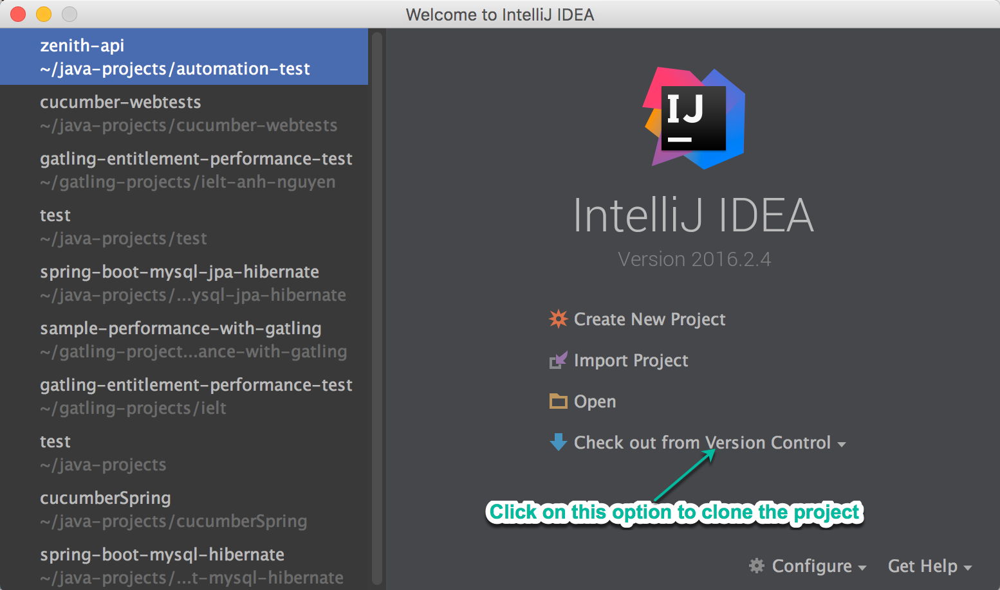
###### Step 2
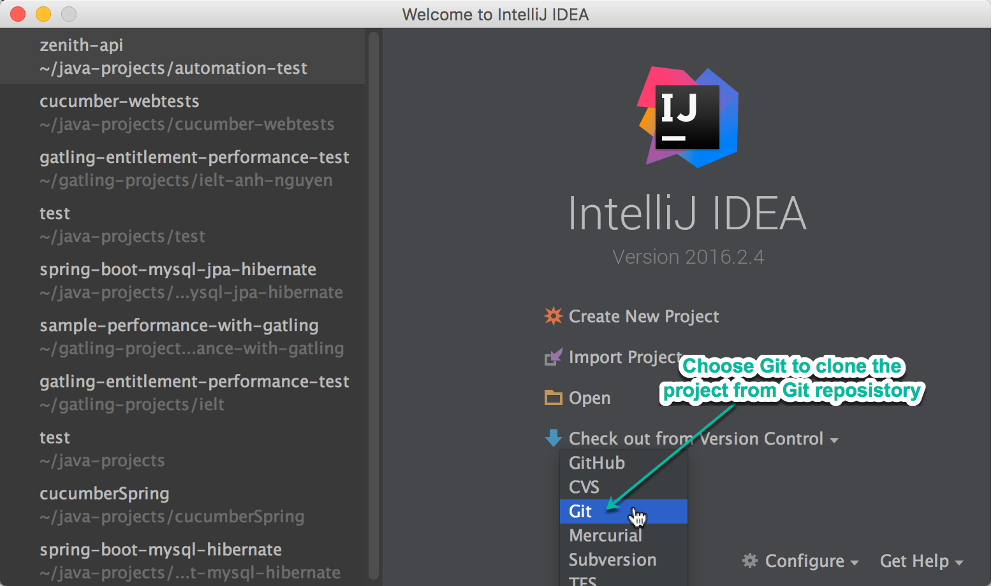
###### Step 3
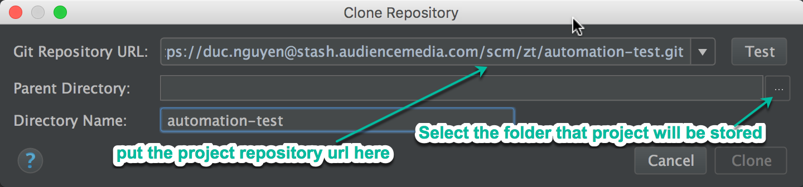
###### Step 4
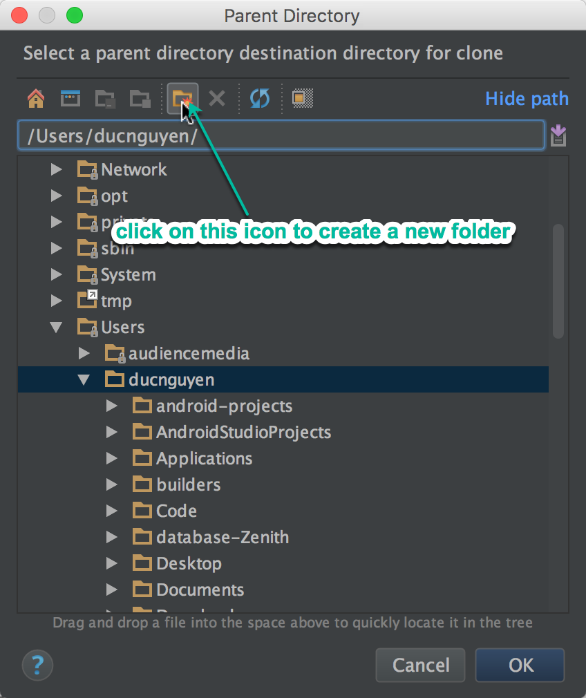
###### Step 4-b (Optional)
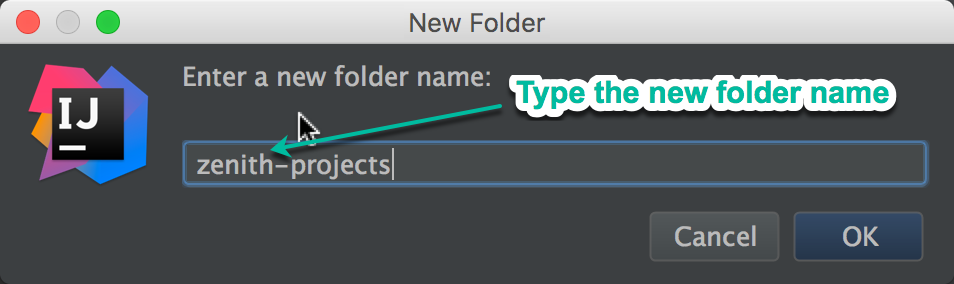
###### Step 5
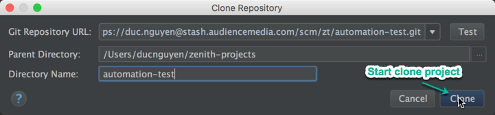
###### Step 6
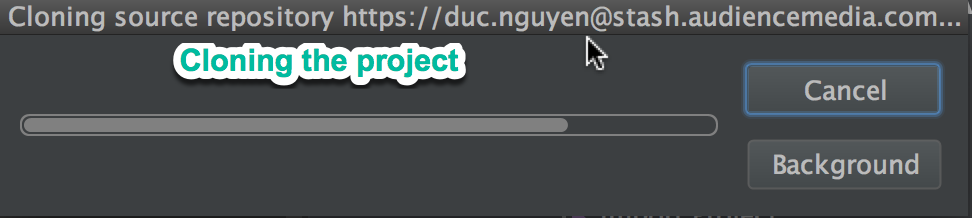
###### Step 7
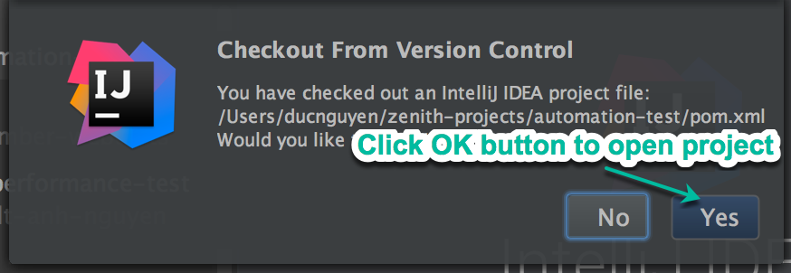
###### Step 8
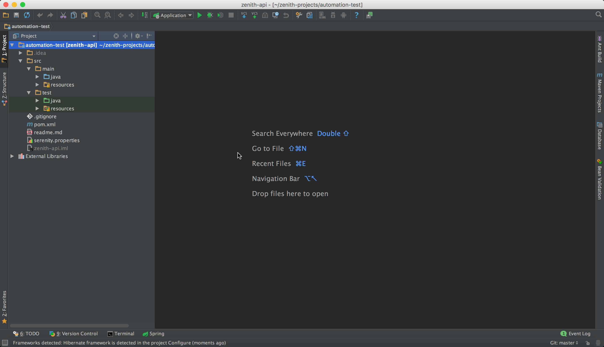

##### For any opened projects in IntelliJ
Select the menu option:
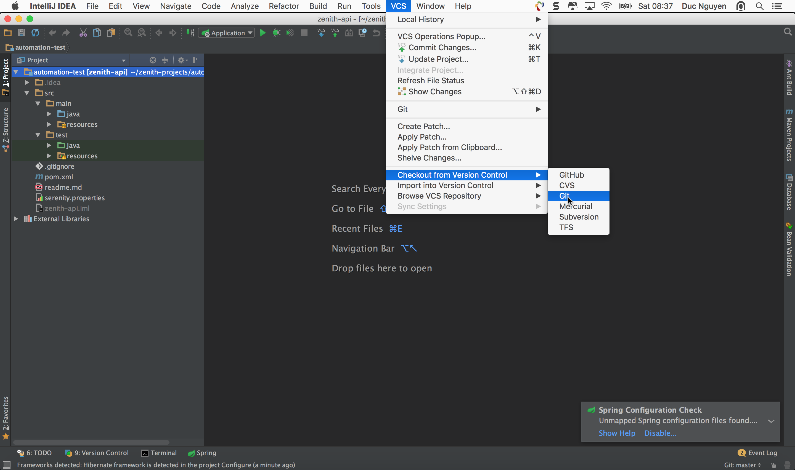

Following the step 2 form the session "For the empty projects or first time open IntelliJ" to the rest.  

#### Verify Cucumber for java plugin has been installed to IntelliJ
Run IntelliJ IDE then go open the plugin  
###### Step 1
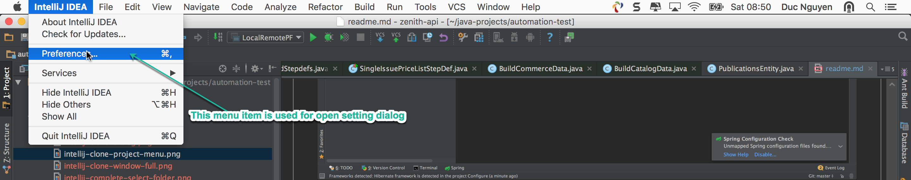
###### Step 2
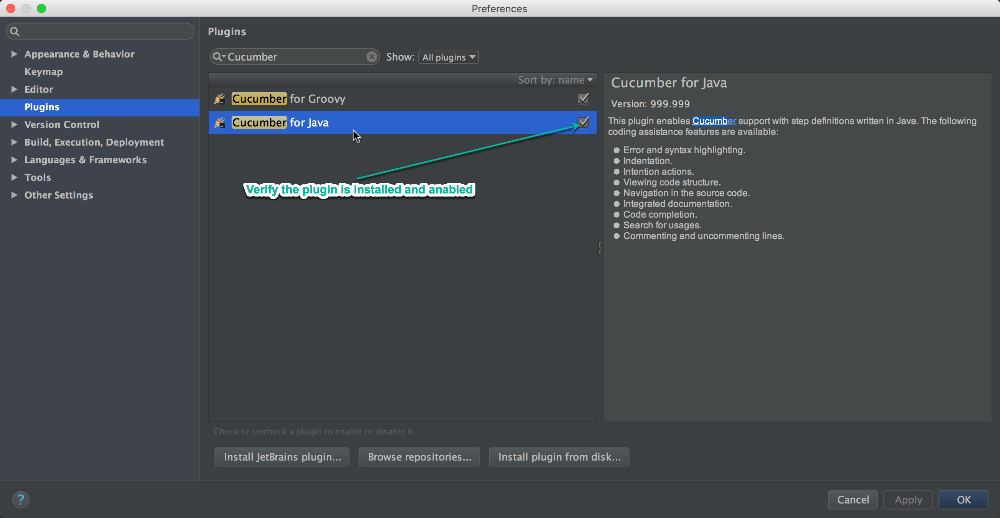

### Usage

### Build and run

#### Configurations
Create local configuration file:
```    
    cp {your-working-folder}/automation-test/src/test/resources/test-application.properties {your-working-folder}/automation-test/src/test/resources/local-application.properties    
```    
Update the {your-working-folder}/automation-test/src/test/resources/local-application.properties to your MySql server
```    
    db.driver:com.mysql.cj.jdbc.Driver
    db.url:jdbc:mysql://localhost:3366?&serverTimezone=UTC
    db.username:root
    db.password:
```    

If your MySql server is under SSH proxy server, you should enable it     
```    
    # database behinds a proxy
    db.behind_proxy:true
    ssh.host:
    ssh.port:
    ssh.user:
    ssh.public_key:false
    ssh.pass:
    db.host:
    db.port:3306
    port.forward:3366
```    

#### From terminal

Go on the project's root folder, then type:

To run the test with the data generator
```    
    $ mvn -P local clean verify -DskipGenerateTestData=true
```    

To run the test with the generated data
```    
    $ mvn -P local clean verify
```    

#### From Intellij 


